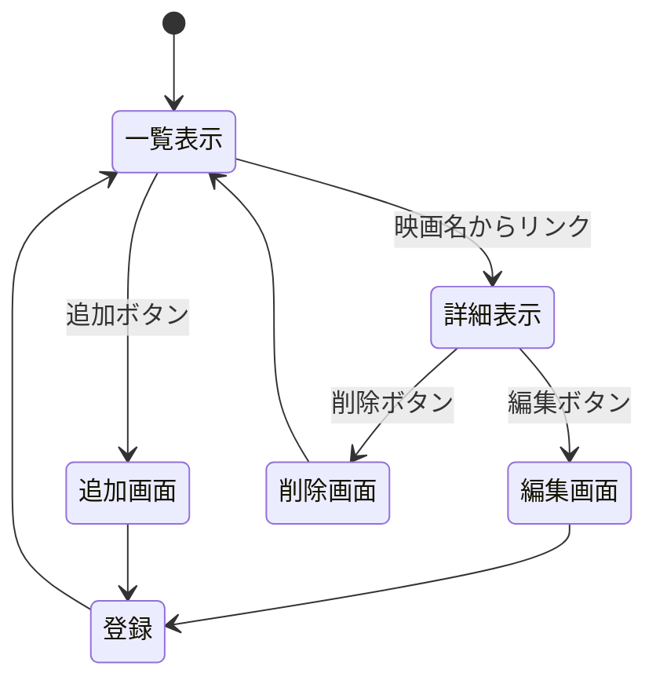

# 開発者用仕様書：授業シラバス管理システム

## 1. システム概要

大学の授業データを管理する Web アプリケーション．
授業名，担当教授，教室などの情報を一覧表示し，詳細確認，新規追加，編集，削除を行うことができる．

---

## 2. データ構造

サーバーサイド（`app5.js`）の変数 `syllabus`（配列）に以下のオブジェクト構造でデータを保持する．

**変数名:** `syllabus`

| 項目名   | 変数名      | 型     | 内容           |
| :------- | :---------- | :----- | :------------- |
| ID       | `id`        | 数値   | 授業 ID        |
| 授業名   | `title`     | 文字列 | 講義の名称     |
| 担当教授 | `professor` | 文字列 | 教授の名前     |
| 教室     | `room`      | 文字列 | 講義室・教室名 |

---

## 3. リソースと機能 (API 設計)

RESTful な設計に基づき，以下の URL と HTTP メソッドで機能を実装する．

| 機能                 | メソッド | リソース名 (URL)       | 処理内容                                                                                                                |
| :------------------- | :------- | :--------------------- | :---------------------------------------------------------------------------------------------------------------------- |
| **一覧表示**         | GET      | `/syllabus`            | 変数 `syllabus` の全データをテーブル形式で一覧表示する．各行に詳細，編集，削除へのリンクを配置する．                    |
| **詳細表示**         | GET      | `/syllabus/:id`        | パスパラメータ `:id` に対応する授業データを 1 件取得し，詳細画面を表示する．                                            |
| **新規登録フォーム** | GET      | `/syllabus/create`     | 新規データを入力するための HTML フォーム（`syllabus_new.html`）を表示する．                                             |
| **新規登録処理**     | POST     | `/syllabus`            | フォームから送信されたデータを受け取り，`syllabus` 配列に追加する．処理後は一覧画面へリダイレクトする．                 |
| **編集フォーム**     | GET      | `/syllabus/edit/:id`   | 指定された ID の現在のデータをフォームに入力済みの状態で表示する．                                                      |
| **更新処理**         | POST     | `/syllabus/update/:id` | フォームから送信された変更データで，`syllabus` 配列内の該当データを上書き更新する．処理後は一覧画面へリダイレクトする． |
| **削除処理**         | GET      | `/syllabus/delete/:id` | 指定された ID のデータを `syllabus` 配列から削除する．処理後は一覧画面へリダイレクトする．                              |

---

## 4. ページ遷移図

画面間の遷移フローは以下の通りである．

